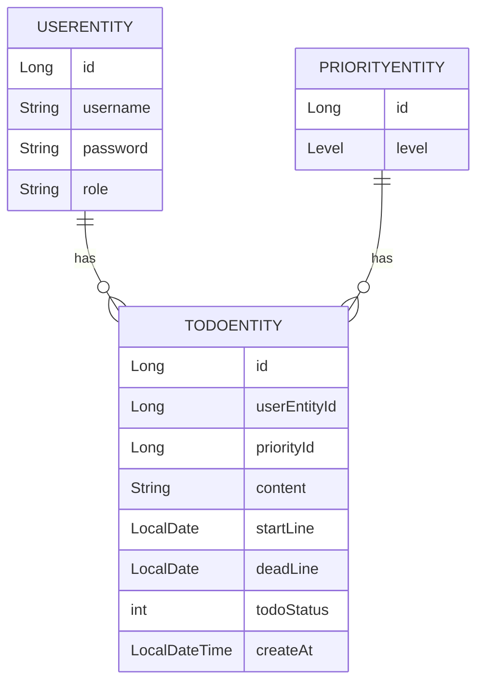

# Entity Structure
## *TodoEntity*

| Field            | Type            | Constraints                                      | Description                  |
|------------------|-----------------|--------------------------------------------------|------------------------------|
| `id`             | `Long`          | `@Id`, `@GeneratedValue`, `@SequenceGenerator`   | Primary key                  |
| `userEntity`     | `UserEntity`    | `@ManyToOne`, `@JoinColumn`                      | Reference to `UserEntity`    |
| `priorityEntity` | `PriorityEntity`| `@ManyToOne`, `@JoinColumn`                      | Reference to `PriorityEntity`|
| `content`        | `String`        |                                                  | Todo content                 |
| `startLine`      | `LocalDate`     |                                                  | Start date                   |
| `deadLine`       | `LocalDate`     |                                                  | Deadline                     |
| `todoStatus`     | `TodoStatus`    | `@Enumerated(EnumType.ORDINAL)`                  | Todo status                  |
| `createAt`       | `LocalDateTime` |                                                  | Creation timestamp           |

### Annotations and Methods

- `@Entity`
- `@Getter`
- `@NoArgsConstructor`
- `@SequenceGenerator(name = "todo_gen", sequenceName = "todo_seq")`
- `@Builder`
- `addTodo()`
- `complete()`
- `cancel()`

## *UserEntity*

| Field      | Type               | Constraints                                      | Description   |
|------------|--------------------|--------------------------------------------------|---------------|
| `id`       | `Long`             | `@Id`, `@GeneratedValue`, `@SequenceGenerator`   | Primary key   |
| `username` | `String`           |                                                  | Username      |
| `password` | `String`           |                                                  | Password      |
| `role`     | `String`           |                                                  | User role     |
| `todos`    | `List<TodoEntity>` | `@OneToMany(mappedBy = "userEntity")`            | List of todos |

### Annotations and Methods

- `@Entity`
- `@Getter`
- `@NoArgsConstructor`
- `@SequenceGenerator(name = "user_gen", sequenceName = "user_seq")`
- Constructor with `username`, `password`, `role`

## *PriorityEntity*

| Field      | Type               | Constraints                                      | Description   |
|------------|--------------------|--------------------------------------------------|---------------|
| `id`       | `Long`             | `@Id`, `@GeneratedValue`, `@SequenceGenerator`   | Primary key   |
| `level`    | `Level`            | `@Enumerated(EnumType.STRING)`                   | Priority level|

### Annotations and Methods

- `@Entity`
- `@Getter`
- `@NoArgsConstructor`
- `@SequenceGenerator(name = "priority_gen", sequenceName = "priority_seq")`
- `@Builder`

## *Relationships*

